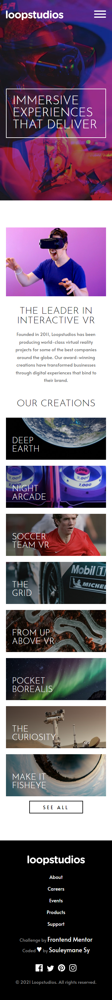
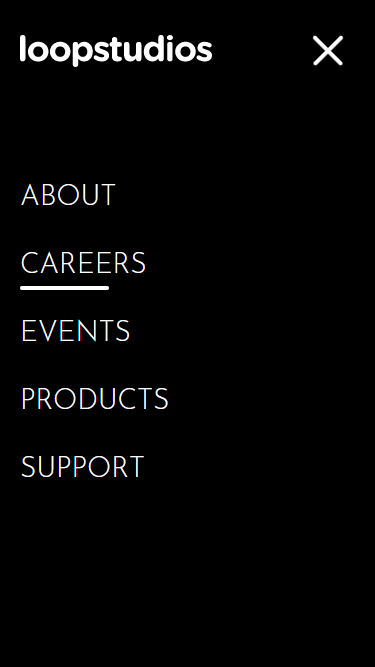
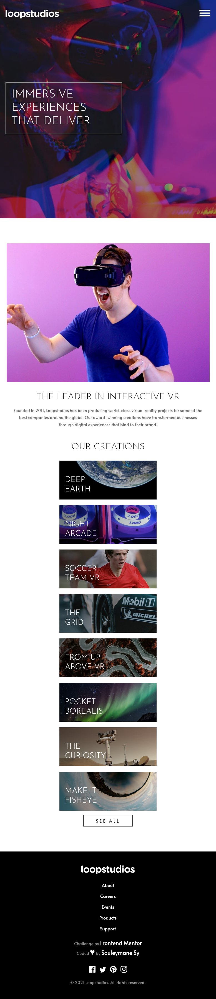
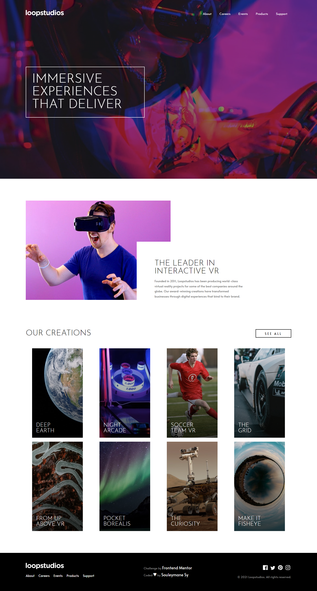

# Frontend Mentor - Loopstudios landing page

## Welcome! 👋

Thanks for checking out this front-end coding challenge.

This is a solution to the [Loopstudios landing page challenge on Frontend Mentor](https://www.frontendmentor.io/challenges/loopstudios-landing-page-N88J5Onjw).

[Frontend Mentor](https://www.frontendmentor.io) challenges help you improve your coding skills by building realistic projects.

## Table of contents

- [The challenge](#the-challenge)
- [Screenshot](#screenshot)
- [My process](#my-process)
- [Built with](#built-with)
- [What I learned](#what-i-learned)
- [Author](#author)

## The challenge

The challenge is to build out this landing page and get it looking as close to the design as possible.

Your users should be able to:

- View the optimal layout for the site depending on their device's screen size
- See hover states for all interactive elements on the page

## Screenshot

This is the Screenshot of my work!

### Mobile

### Mobile Menu Toggle

### Tablets

### Desktops

### Links

- Solution URL: [solution URL here](https://www.frontendmentor.io/solutions/loopstudios-responsive-landing-page-made-with-html-sass-vite-lRPo-pi_El)
- Live Site URL: [live site URL here](https://fem-loopstudios-landing-page-iota.vercel.app/)

## My process

Made this projects with HTML5 and SASS for the project structure and some Javascript for the toggle menu. I used Vite for the projects managements!

### Built with

- Semantic HTML5 markup
- SASS
- CSS custom properties
- Flexbox
- CSS Grid
- Mobile-first workflow
- Vite
- NPM

### What I learned

Learned to work with Vite. it's my first try with Vite, it is very fast and easy to use.

## Author

- GitHub - [Souleymane Sy](https://github.com/SouleymaneSy7)
- Frontend Mentor - [@SouleymaneSy7](https://www.frontendmentor.io/profile/SouleymaneSy7)
- Twitter - [@Souleymanesy43](https://twitter.com/Souleymanesy43)
